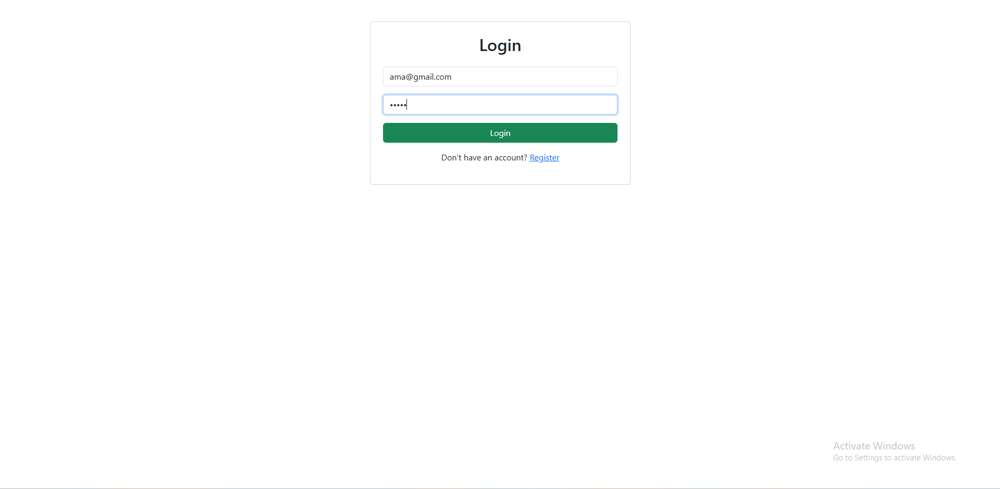
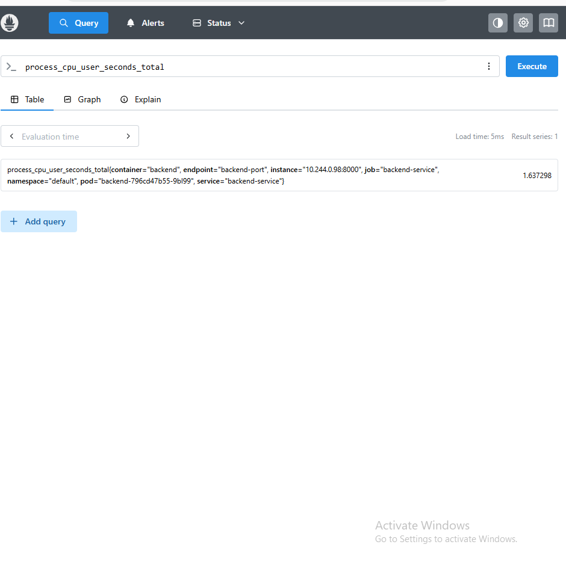

# Leave Track System


A full-stack **Leave Management System** developed using **React, Node.js, Express, and PostgreSQL**, demonstrating modern DevOps practices with **Docker, Kubernetes, Helm, Terraform, GitHub Actions, Prometheus, and Grafana**.

---

# Application Preview




---

# Project Overview

The Leave Track System allows employees to submit leave requests while administrators can manage users and approve or reject leave applications through a web-based dashboard.

The project also demonstrates a complete DevOps workflow including:

- Docker containerization
- Kubernetes deployment
- Helm packaging
- Infrastructure provisioning using Terraform
- CI/CD with GitHub Actions
- Monitoring with Prometheus and Grafana

---

# Features

- User Authentication
- Employee Dashboard
- Admin Dashboard
- Leave Request Management
- PostgreSQL Database
- RESTful API
- Dockerized Services
- Kubernetes Deployment
- Helm Charts
- Infrastructure as Code (Terraform)
- CI/CD Pipeline
- Monitoring & Visualization

---

# Technology Stack

## Frontend

- React
- Bootstrap
- Axios

## Backend

- Node.js
- Express.js
- PostgreSQL

## DevOps

- Docker
- Docker Compose
- Kubernetes
- Helm
- Terraform
- GitHub Actions
- Prometheus
- Grafana

---

# Project Structure

```text
leave-track-system/
│
├── backend/
├── frontend/
├── infrastructure/
│   ├── helm/
│   └── terraform/
│
├── docs/
│   ├── image/
│   ├── videos/
│   └── index.html
│
├── .github/
│   └── workflows/
│
└── README.md
```

---

# Clone the Repository

```bash
git clone https://github.com/amany13-lang/My-Final-Project-DevOps.git

cd leave-track-system
```

---

# Docker

Build Backend Image

```bash
docker build -t amany513/leave-track-backend:latest ./backend
```

Build Frontend Image

```bash
docker build -t amany513/leave-track-frontend:latest ./frontend
```

Run Containers

```bash
docker-compose up -d
```

---

# Kubernetes Deployment

Deploy using Helm

```bash
helm install leave-track ./infrastructure/helm
```

Verify Resources

```bash
kubectl get pods

kubectl get svc

helm list
```

---

# Terraform

Initialize Terraform

```bash
terraform init
```

Validate Configuration

```bash
terraform validate
```

Generate Execution Plan

```bash
terraform plan
```

Provision Infrastructure

```bash
terraform apply
```

---

# CI/CD Pipeline

GitHub Actions automates the following workflow:

- Backend Build
- Frontend Build
- Docker Image Build
- Docker Hub Push
- Terraform Validate
- Terraform Plan
- Terraform Apply

---

# Monitoring

Monitoring is implemented using:

- Prometheus for metrics collection
- Grafana for dashboards and visualization

### Grafana Dashboard


### Prometheus



---

# Documentation

Complete project documentation is available inside the **docs** folder.

It includes:

- Application Demo
- Kubernetes Deployment
- Docker
- CI/CD Pipeline
- Monitoring
- System Architecture

Open:

```text
docs/index.html
```

---

# Demo Video

The application demo video is available in:

```text
docs/videos/
```

or can be viewed through the documentation page.

---

# Architecture

The project architecture includes:

- React Frontend
- Node.js & Express Backend
- PostgreSQL Database
- Docker
- Kubernetes
- Helm
- Terraform
- GitHub Actions
- Prometheus
- Grafana

---

# Future Improvements

- Email Notifications
- Role-Based Access Control (RBAC)
- AWS EKS Deployment
- HTTPS with Ingress Controller
- Horizontal Pod Autoscaler
- Automated Testing Pipeline

---
